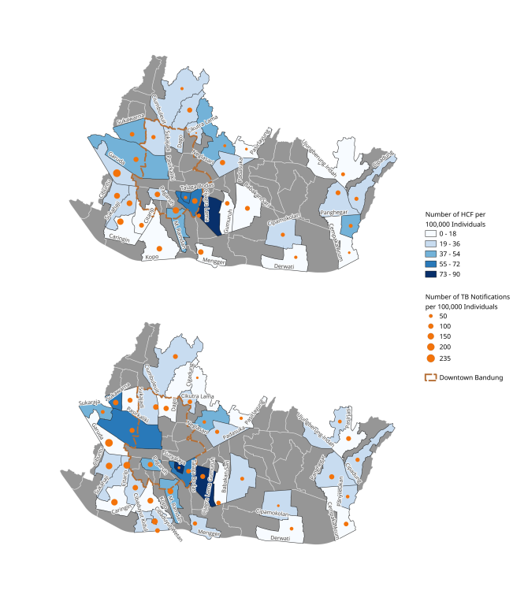

# Maps

Bandung and West Java maps were originally taken from the Bandung Municipal Government website (satudata.bandung.go.id) but has since been taken down. The maps have now been copied to this repository. Maps copied include Map of Bandung City Regions (Wilayah), District (Kecamatan), and Sub-District (Kelurahan). Inaccuracies in the original maps have been edited. Map of the Puskesmas (Community Health Centers) regions has been created from the Kelurahan (Sub-district) map.

## Example Maps

> Koesoemadinata RC, McAllister S, Huang C, Hartati S, Djunaedy H, Dewi NF, et al. Should neighbours of tuberculosis (TB) cases be prioritised for active case finding in high TB-burden settings? A prospective molecular epidemiological study. BMJ Global Health. 2025;10:e019137. <https://doi.org/10.1136/bmjgh-2025-019137>

> Widarna R, Afifah N, Djunaedy HAK, Sassi A, Vasquez NA, Oga-Omenka C, Salindri AD, Lestari BW, Pai M, Alisjahbana B. The shifting landscape of private healthcare providers before and during the COVID-19 pandemic: Lessons to strengthen the private sectors engagement for future pandemic and tuberculosis care. PLOS Glob Public Health. 2024 Oct 3;4(10):e0003112. <https://doi.org/10.1371/journal.pgph.0003112>
